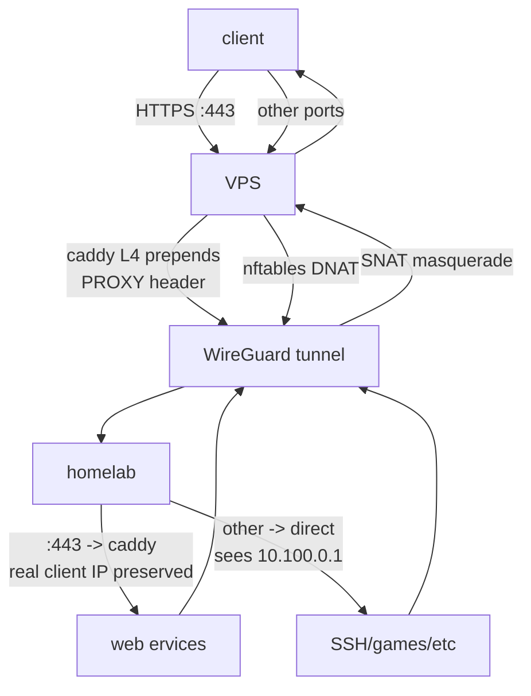

# nix-wg-proxy

declarative nixos flake for turning a vps into a wireguard reverse proxy to your homelab.

all traffic (http, game servers, smtp, whatever) terminates on the homelab after being forwarded over an encrypted wireguard tunnel. the vps never sees plaintext - it just routes packets.

optionally includes caddy layer4 proxy to preserve client source ips for https traffic.



> see the [blog post](https://xhos.dev/posts/nix-wg-proxy) for more details

## why

most isps block ports 80/443/25. even if they don't, exposing your home ip isn't great. this setup:

- doesn't require dynamic dns
- doesn't require port forwarding on your home router
- keeps tls termination on your own hardware
- works for any tcp/udp service, not just http
- supports multiple vps proxies for redundancy
- declarative and reproducible ❄️

```plaintext
.
├── config.nix # shared config for all servers
├── flake.nix # entrypoint
├── hosts
│   ├── proxy-1
│   │   └── configuration.nix # host specific config
│   └── proxy-2
│       └── configuration.nix
└── proxy.nix # main module
```

## quick start

### 1. get a vps

any provider works. 1 vcpu / 1gb ram is plenty. if they offer nixos, use it. otherwise pick ubuntu 22.04 or similar.

### 2. install nixos (if needed)

```bash
ssh your-vps 'curl -fsSL https://raw.githubusercontent.com/elitak/nixos-infect/master/nixos-infect -o /tmp/nixos-infect && sudo NIX_CHANNEL=nixos-25.05 bash -x /tmp/nixos-infect'
```

### 3. prepare homelab wireguard

add this to your homelab config (we'll fill in the vps pubkey later):

```nix
networking.wireguard.interfaces.wg0 = {
  mtu = 1408;
  ips = ["10.100.0.10/24"];
  privateKeyFile = "/var/lib/wireguard/private.key";
  generatePrivateKeyFile = true;
  peers = [{
    publicKey = ""; # fill after vps rebuild
    endpoint = "VPS_PUBLIC_IP:55055";
    allowedIPs = ["10.100.0.1/32"];
    persistentKeepalive = 25;
  }];
};
```

apply it, then grab the homelab pubkey:

```bash
sudo cat /var/lib/wireguard/private.key | wg pubkey
```

### 4. configure the flake

clone this repo. edit `config.nix`, and `hosts/proxy-1/configuration.nix`

### 5. get hardware config

```bash
ssh your-vps 'nixos-generate-config --show-hardware-config' > hosts/proxy-1/hardware-configuration.nix
```

### 6. deploy

```bash
nixos-rebuild switch --flake .#proxy-1 --target-host your-vps --install-bootloader
```

the rebuild will print the vps wireguard pubkey. add it to your homelab peer config and rebuild the homelab.

## client ip preservation

by default, all traffic appears to come from the wireguard tunnel ip (`10.100.0.1`). this breaks rate limiting, analytics, fail2ban, etc.

set `enable_proxy_protocol = true` to run caddy with layer4 proxy protocol for https. your homelab reverse proxy must accept proxy protocol v2 on port 443.

example caddy config on homelab:

```caddyfile
{
  servers {
    listener_wrappers {
      proxy_protocol
    }
  }
}
```

## multiple proxies

1. add entry to `flake.nix`
2. create `hosts/proxy-2/configuration.nix`
3. deploy with `--flake .#proxy-2`

useful for redundancy across providers, oracle has been known to randomly nuke free tier accounts. for configuring dns record fallback and healthchecks see the [blog post](https://xhos.dev/posts/nix-wg-proxy).
