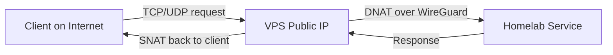

# nix-wg-proxy

> [!TIP]
> This repository is a template meant to be forked and adapted.

This system flake turns a VPS into a **WireGuard endpoint and NAT gateway**.  
All public traffic (HTTP, game ports, SMTP, etc.) terminates on the VPS, is DNAT-forwarded over the encrypted WireGuard tunnel to your homelab, and SNAT-masqueraded on return.  
The VPS does not terminate TLS or run application services. Its sole role is to securely expose selected ports of the homelab to the internet.

Fully declarative, takes about 10 minutes to set up.



## requirements

- A local computer or VM running NixOS (used to deploy)
- A VPS that will be reimaged into NixOS (often starts as Ubuntu)

## fork and adapt

Fork/clone this repo and edit [configuration.nix](./configuration.nix).
Most importantly, replace the SSH public key with one that already has access to your VPS.

## deploy

Covers both the initial NixOS install on a fresh VPS (often Ubuntu by default) and deployment of this flake.
Tested so far only on Oracle free tier `VM.Standard.E2.1.Micro` with Ubuntu 24.04.

> [!NOTE]
> `your-server` is an SSH alias pointing to your VPS.

### option 1: `nixos-infect` (for servers with less than 1GB RAM) (recommended, default)

Run from your local machine (VPS must already accept your SSH key):

```bash
ssh your-server 'curl -fsSL https://raw.githubusercontent.com/elitak/nixos-infect/master/nixos-infect -o /tmp/nixos-infect && sudo NIX_CHANNEL=nixos-25.05 bash -x /tmp/nixos-infect'
```

The VPS will reboot into NixOS. Only the root user will exist, with the same SSH key access as before.

You need to get the hardware config and add it to git

```bash
ssh root@your-server 'nixos-generate-config --show-hardware-config' > ./hardware-configuration.nix
git add hardware-configuration.nix
```

Then you can rebuild to get the flake onto the server

```bash
nixos-rebuild switch --flake .#vps-proxy --target-host root@proxy --install-bootloader
```

If you didn't see the banner with the WG public key, run the rebuild command again. You'll see something like:

```txt
=========================================
VPS WireGuard public key:
your-wg-key=
Add this to your homelab configuration
=========================================
```

### option 2: `nixos-anywhere` (> 1.5GB RAM VPS)

Not tested here due to RAM limits, but in theory this works with the disko import enabled in flake.nix:

```bash
nix run github:nix-community/nixos-anywhere -- --flake .#vps-proxy your-server
```
